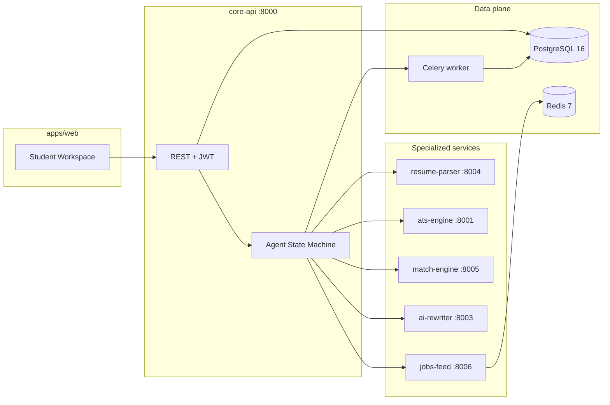

# CareerOS Campus AI

**Placement-readiness operating layer for Indian colleges** — student resumes and job descriptions in; ATS-safe structure, JD match scoring, proof-linked improvements, and exportable outcomes out. Optimized for measurable Intel acceleration on matching workloads.

[](apps/web)
[](services/core-api)
[](docker-compose.yml)
[](docs/benchmarks/match-engine-sklearnex.md)
[](.)

---

## Table of contents

1. [Executive summary](#executive-summary)
2. [Why this matters](#why-this-matters)
3. [The problem we solve](#the-problem-we-solve)
4. [Background and product thesis](#background-and-product-thesis)
5. [About CareerOS Campus AI](#about-careeros-campus-ai)
6. [How CareerOS compares](#how-careeros-compares)
7. [Solution overview](#solution-overview)
8. [Architecture](#architecture)
9. [Technology stack](#technology-stack)
10. [PlacementReadinessScore](#placementreadinessscore)
11. [Deterministic placement agent](#deterministic-placement-agent)
12. [Intel optimization](#intel-optimization)
13. [Repository structure](#repository-structure)
14. [Getting started](#getting-started)
15. [Configuration](#configuration)
16. [Development standards](#development-standards)
17. [Documentation](#documentation)
18. [Roadmap](#roadmap)
19. [License](#license)

---

## Executive summary

CareerOS Campus AI is **not** a job board, LinkedIn scraper, recruiter marketplace, or generic “AI resume writer.” It is an **institutional placement-readiness system** built for the Indian campus context: students get a guided path from resume upload through job-aware scoring and safe rewrites; placement teams (when enabled) get cohort-level visibility instead of manual spreadsheet triage.

The platform is implemented as a **production-style monorepo**: a typed web application, a central orchestration API, specialized microservices for parsing, ATS safety, matching, rewriting, and job discovery, shared scoring logic, PostgreSQL persistence, and Redis-backed async work. Matching pipelines use **Intel Extension for Scikit-learn (sklearnex)** with published, reproducible benchmarks—not marketing claims.

---

## Why this matters

Indian higher education produces millions of graduates each year, yet a large share remain **difficult to place** relative to employer expectations. National employability surveys consistently report that fewer than half of job-seeking graduates meet overall employability bars; labour-market reports highlight **education–aspiration–job mismatches**, especially among educated youth.

Campus placement is not only a student skills problem—it is an **operations problem**:

- Placement offices verify resume claims, enforce deadlines, and coordinate shortlists, tests, and interviews with limited tooling.
- Students use decorative templates that **fail ATS parsing** (columns, graphics, non-standard headings).
- Consumer “AI resume” products optimize wording but often **invent experience** and offer no proof-linked guardrails or college-wide analytics.

CareerOS targets the gap between **individual resume tools** and **college placement workflow**: measurable readiness, audit-friendly agent runs, and a single student journey from job discovery to export—without pretending to replace Naukri or run a recruiter network.

---

## The problem we solve

| Stakeholder | Pain today | What CareerOS delivers |
|-------------|------------|-------------------------|
| **Student** | No clear loop from “I have a resume” to “this role is a fit and my PDF is safe to submit” | Upload → parse → ATS flags → JD match score → proof-linked rewrite → ATS-oriented export |
| **Placement officer** | Manual proof checks, inconsistent formats, weak department-level insight | Batch-oriented views, review queues, skill-gap signals (roadmap; feature-flagged in current release) |
| **College leadership** | Hard to justify training spend without readiness baselines | Aggregated readiness scores and exportable reports (roadmap) |

Concrete technical pains addressed in the **current release**:

1. **ATS parse failure** — multi-column Canva layouts, missing standard sections, and header/footer contact blocks that parsers drop.
2. **Opaque “match %”** — keyword stuffing without structured JD match, skill recall, or eligibility rules.
3. **Unsafe AI rewrites** — fabricated bullets that fail verification and harm trust.
4. **Fragmented workflow** — students jump between job sites, Word, ChatGPT, and placement email threads with no persisted audit trail.

---

## Background and product thesis

### 1. What is the problem?

Fresher hiring in India is high-volume and low-signal. Students compete with similar degrees; employers and ATS systems filter on structure, keywords, and evidence. Placement cells act as gatekeepers but lack software that connects **resume quality**, **role fit**, and **cohort outcomes** in one system.

### 2. Why is it a structural problem?

- **Scale**: Very large graduate cohorts per institution and per department.
- **Employability gap**: Graduate skill indices show persistent shortfalls in applied and soft skills expected by employers.
- **ATS reality**: Major applicant tracking systems reject or mangle resumes that are visually appealing but machine-unfriendly.
- **Institutional process**: Top campus placement policies already require proof-linked resume points and approval before students enter the pool—yet most colleges still execute this in email and spreadsheets.

### 3. How can it be resolved?

A credible resolution requires four layers working together:

1. **Ingestion** — reliable PDF/DOCX parsing into structured sections and evidence links.
2. **Measurement** — a transparent, repeatable readiness score against a specific JD (not a black-box “AI score”).
3. **Improvement with integrity** — suggestions tied to evidence; unsupported claims surfaced, never silently inserted.
4. **Operations** — persistence, role-based access, batch views for placement staff, and export for submission.

### 4. How CareerOS resolves it

CareerOS implements those layers as **composable services** orchestrated by `core-api`:

```
Resume file → resume-parser → structured sections
           → ats-engine   → parse-safety penalties
           → match-engine → JD similarity + skill recall + eligibility
           → packages/scoring → PlacementReadinessScore
           → ai-rewriter    → proof-linked section updates
           → Celery export  → ATS-oriented PDF
```

A **deterministic placement agent** chains these steps when a student selects a job: each run is stored in `agent_runs` with step-level status for recovery, demos, and future compliance review.

Job discovery uses a dedicated **jobs-feed** service (external API with Redis cache and local seed fallback) so the student loop stays inside one product surface.

### 5. How this compares to existing approaches

Consumer tools (Jobscan, Rezi, Teal, India-focused builders) excel at **individual** resume scoring and templates. Job portals (Naukri, Internshala, Apna) excel at **distribution and applications**. None are purpose-built as a **college placement operating layer** with:

- proof-linked rewrite guardrails,
- cohort persistence and RBAC,
- a single audited agent run from job → score → rewrite → export,
- Intel-measured acceleration on the matching path.

CareerOS deliberately **does not** scrape LinkedIn, operate a recruiter CRM, or bill students for premium templates. Its wedge is **readiness intelligence inside the campus boundary**.

Deeper market and scoring analysis: [`docs/research/competitive-landscape-and-scoring.md`](docs/research/competitive-landscape-and-scoring.md).

### 6. Project backstory (concise)

CareerOS Campus AI was conceived as a response to the bootcamp-scale question: *Can we show real Intel value on a socially relevant workflow, end-to-end, in weeks—not a slide deck?* The answer was to narrow scope to **placement readiness** (where parsing, numerical matching, and guardrailed text transformation are technically defensible) and to avoid building another job board.

The product evolved in two deliberate phases:

1. **Foundation** — schema, auth, resume parser, match engine, canonical scoring package, proof-linked rewriter, PDF export.
2. **Student-first pivot** — jobs feed, deterministic agent, Jobs and Builder workspace UI, measured sklearnex benchmarks, officer surfaces retained but feature-flagged until cohort dashboards ship.

Architecture decision record: [`docs/adr/0006-student-first-pivot.md`](docs/adr/0006-student-first-pivot.md).

---

## About CareerOS Campus AI

### What it is

A **campus placement-readiness platform** with:

- **Student workspace** — manual tabs (resume, JD, score, rewrite, export) plus **Jobs Feed** and **Builder Wizard** with agent progress polling.
- **Microservice backend** — each concern (parse, ATS, match, rewrite, jobs) isolated for testing and scaling.
- **Shared contracts** — JSON schemas for resume, JD, scorecard, and rewrite payloads under `packages/contracts/`.
- **Single scoring source of truth** — `packages/scoring/` only; services import, never duplicate the formula.

### What it is not

- Not a replacement for Naukri, LinkedIn, or company career pages for job listings at national scale.
- Not an autonomous LLM agent that invents answers; the default agent is **deterministic** and calls existing APIs.
- Not a billing or B2C subscription product in the current codebase.

### Primary user journey (student-first)

1. Upload or select a parsed resume.
2. Search jobs (live feed or seeded fallback).
3. Run the placement agent on a chosen role.
4. Review readiness breakdown, rewrite diff (with unsupported claims listed separately).
5. Download ATS-oriented PDF when the export job completes.

Demo script for presentations: [`docs/pitch/demo-script.md`](docs/pitch/demo-script.md).

---

## How CareerOS compares

| Category | Typical alternative | CareerOS difference |
|----------|--------------------|---------------------|
| ATS checkers | One-off score, consumer account | Parse-safety integrated with college resume store and JD context |
| AI resume writers | Free-form text generation | JSON-schema rewriter; `unsupported_claims[]` never merged into output |
| Job portals | Search and apply only | Job context **feeds** readiness scoring and agent orchestration |
| Placement spreadsheets | Manual tracking | Persisted scorecards, agent runs, future batch dashboards |
| Generic “campus ERP” | Broad admin software | Deep vertical on **resume × JD × evidence × export** |

---

## Solution overview



**Design principles**

- **Orchestration at the edge** — `core-api` owns auth, persistence, and workflow; specialists stay stateless where possible.
- **Fail closed on claims** — rewriter output is schema-validated; unverifiable statements are listed, not applied.
- **Honest labeling** — semantic similarity is reported as `embedding_proxy_tfidf` where full neural embeddings are proxied for latency.
- **Measured performance** — Intel-related speedups are documented from harness output, not slide estimates.

---

## Architecture

### Service responsibilities

| Service | Port | Responsibility |
|---------|------|----------------|
| **core-api** | 8000 | JWT auth, resumes, JD, scorecards, recommendations, agent runs, export queue, HTTP client to all backends |
| **ats-engine** | 8001 | Rule-based ATS parse-safety scoring |
| **ai-rewriter** | 8003 | Proof-linked rewrite (structured JSON, guardrails) |
| **resume-parser** | 8004 | PDF/DOCX ingestion, section extraction |
| **match-engine** | 8005 | TF-IDF + embedding-proxy cosine, skill recall, eligibility; sklearnex-enabled |
| **jobs-feed** | 8006 | Job search adapter, Redis cache, seed JSON fallback |
| **core-worker** | — | Celery worker for PDF generation (WeasyPrint) |

### Layering inside `core-api`

Business logic follows a consistent layout:

- `app/api/controllers/` — thin HTTP adapters
- `app/modules/<domain>/mutation|query/` — use cases
- `app/adapter/db/persistence/` — repositories
- `app/services/clients.py` — all cross-service HTTP (httpx)

Schema changes require **Alembic** migrations under `services/core-api/migrations/versions/`.

### Web application

- **Framework**: Next.js 14 App Router, React 18, TypeScript strict mode.
- **Styling**: Design tokens and components via CSS variables in `apps/web/app/globals.css` (no utility-first CSS framework).
- **API access**: Typed functions in `apps/web/lib/api.ts` only.
- **State**: `apps/web/hooks/usePlacementWorkspace.ts` for workspace and agent run state.

### Security model

- JWT with `student`, `officer`, and `admin` role claims.
- Route guards (`require_student`, `require_officer`) on role-specific endpoints.
- Officer-facing routes and navigation are **disabled by default** via feature flags (see [Configuration](#configuration)).

---

## Technology stack

| Layer | Technologies |
|-------|----------------|
| **Frontend** | Next.js 14, React 18, TypeScript 5.6, Motion |
| **API / orchestration** | FastAPI 0.115, Pydantic v2, SQLAlchemy 2.0 |
| **Database** | PostgreSQL 16, Alembic |
| **Cache / queue** | Redis 7, Celery |
| **Document processing** | pdfplumber, python-docx, WeasyPrint (export) |
| **Matching / ML** | scikit-learn, sklearnex patch, TF-IDF and similarity primitives |
| **Intel (current + planned)** | sklearnex (measured); OpenVINO path planned in `intel-bench` with accuracy gates |
| **Contracts** | JSON Schema in `packages/contracts/` |
| **Scoring library** | Python package `packages/scoring/` |
| **Runtime** | Docker Compose for local and demo environments |
| **Package management** | pnpm 9 (monorepo), pip per Python service |

---

## PlacementReadinessScore

The canonical formula lives **only** in `packages/scoring/`. Services import it; they do not reimplement weights.

```
PlacementReadinessScore =
  0.35 × JD_Match
+ 0.20 × ATS_Parse_Safety
+ 0.20 × Evidence_Quality
+ 0.10 × Profile_Completeness
+ 0.10 × Interview_Readiness
+ 0.05 × Placement_Hygiene

JD_Match =
  0.35 × TFIDF_Cosine
+  0.35 × Embedding_Cosine
+  0.20 × Required_Skill_Recall
+  0.10 × Eligibility_Rule_Score
```

**Readiness buckets**

| Range | Label |
|-------|--------|
| 0–49 | High risk |
| 50–69 | Borderline |
| 70–84 | Ready |
| 85–100 | Strong |

---

## Deterministic placement agent

The agent automates the student loop without a free-form LLM planner. It is appropriate for demos, audits, and predictable campus pilots.

**API**

- `POST /agent/run` — start a run for `(resume_id, job_id or jd payload)`
- `GET /agent/runs/{id}` — step status and summary JSON

**Typical step sequence**

`INIT` → `PARSED` → `ATS_SCORED` → `JD_RESOLVED` → `JD_MATCHED` → `REWRITTEN` → `EXPORT_READY` → `DONE`

Each run is persisted in `agent_runs` with `summary_json` for inspection and recovery.

---

## Intel optimization

CareerOS uses Intel technologies where they map to real workloads:

| Workload | Baseline | Intel path | Status |
|----------|----------|------------|--------|
| TF-IDF / cosine / clustering | stock scikit-learn | **sklearnex** (`patch_sklearn()` before imports) | Measured — see below |
| Embedding inference | PyTorch CPU | OpenVINO FP16 (optional INT8 with ≤1% accuracy loss) | Planned in `intel-bench` |

**Published benchmark** (50×50 resume–JD matrix, 2,500 match calls):

| Metric | Stock sklearn | sklearnex |
|--------|--------------:|----------:|
| p50 latency | 20.878 ms | 18.381 ms |
| p95 latency | 29.978 ms | 25.968 ms |
| Throughput uplift | — | +23.96% |

Reproduce: `services/match-engine/bench/run.py` — details in [`docs/benchmarks/match-engine-sklearnex.md`](docs/benchmarks/match-engine-sklearnex.md).

If a target machine shows no gain, the codebase stays on stock sklearn and reports measurements honestly.

---

## Repository structure

```
CareerOS/
├── apps/web/                 # Next.js student workspace
├── packages/
│   ├── contracts/            # JSON Schema definitions
│   ├── scoring/              # PlacementReadinessScore (single source)
│   └── ts-types/             # Generated TypeScript types
├── services/
│   ├── core-api/             # Orchestration API + migrations + Celery
│   ├── ats-engine/
│   ├── ai-rewriter/
│   ├── resume-parser/
│   ├── match-engine/         # includes bench/ harness
│   ├── jobs-feed/
│   └── intel-bench/          # Intel benchmark panel (roadmap)
├── infra/seed/               # Fallback job seed data
├── docs/
│   ├── adr/                  # Architecture decision records
│   ├── benchmarks/           # Measured performance artifacts
│   ├── pitch/                # Demo and presentation materials
│   └── research/             # Market and technical research
├── tests/                    # Cross-cutting end-to-end tests
├── docker-compose.yml
└── pnpm-workspace.yaml
```

---

## Getting started

### Prerequisites

| Tool | Version |
|------|---------|
| Node.js | 18+ |
| pnpm | 9+ |
| Python | 3.10+ |
| Docker & Docker Compose | latest |

### Run the full stack

```bash
# Install frontend dependencies
pnpm install

# Start databases and all backend services
docker compose up -d --build

# Start the web application
pnpm dev
```

### Service URLs (local)

| URL | Description |
|-----|-------------|
| http://localhost:3000 | Web application |
| http://localhost:8000/docs | Core API (OpenAPI) |
| http://localhost:8001/docs | ATS engine |
| http://localhost:8004/docs | Resume parser |
| http://localhost:8005/docs | Match engine |
| http://localhost:8006/docs | Jobs feed |

Stop the stack:

```bash
docker compose down
```

### Database migrations

Local Compose sets `AUTO_CREATE_TABLES=true` for convenience. For production-style workflows:

```bash
cd services/core-api
alembic upgrade head
```

### Verification (recommended after changes)

```bash
pnpm --filter ./apps/web exec tsc --noEmit
cd services/core-api && pytest tests/test_agent_run_golden_path.py tests/test_scoring_golden_path.py
```

---

## Configuration

### Core API (`services/core-api`)

| Variable | Purpose | Default (local) |
|----------|---------|-----------------|
| `DATABASE_URL` | PostgreSQL connection | Set in Compose |
| `REDIS_URL` | Celery broker / cache | `redis://redis:6379/0` |
| `JWT_SECRET` | Signing key | **Change in production** |
| `AUTO_CREATE_TABLES` | Dev table bootstrap | `true` in Compose |
| `ENABLE_OFFICER_SURFACE` | Expose officer API routes | `false` |
| `ATS_ENGINE_URL` | ATS service base URL | `http://ats-engine:8001` |
| `MATCH_ENGINE_URL` | Match service | `http://match-engine:8005` |
| `AI_REWRITER_URL` | Rewriter service | `http://ai-rewriter:8003` |
| `RESUME_PARSER_URL` | Parser service | `http://resume-parser:8004` |
| `JOBS_FEED_URL` | Jobs feed service | `http://jobs-feed:8006` |
| `EXPORTS_DIR` | PDF output directory | `/tmp/careeros-exports` |

### Web (`apps/web`)

| Variable | Purpose |
|----------|---------|
| `NEXT_PUBLIC_API_BASE_URL` | Core API origin (e.g. `http://localhost:8000`) |
| `NEXT_PUBLIC_ENABLE_OFFICER_SURFACE` | Show officer navigation |

### Jobs feed (optional live data)

| Variable | Purpose |
|----------|---------|
| `ADZUNA_APP_ID` | Live job search credentials |
| `ADZUNA_APP_KEY` | Live job search credentials |

Without Adzuna credentials, the service serves roles from `infra/seed/jobs.seed.json`.

---

## Development standards

- **HTTP from the web app** — only through `apps/web/lib/api.ts`.
- **Thin controllers** — business logic in `app/modules/`, not route files.
- **SQLAlchemy 2.0 style** — `Mapped[T]` / `mapped_column()`; no legacy `Column()`.
- **Pydantic v2** — `.model_dump()` / `.model_validate()`.
- **Migrations** — any schema change ships with an Alembic revision.
- **No fabrication** — rewriter must populate `unsupported_claims[]` instead of inventing experience.
- **Scoring** — import from `packages/scoring/`; never copy formula constants into services.
- **Cross-service calls** — `services/core-api/app/services/clients.py` (httpx only).

Engineering governance and agent-oriented project rules: [`AGENTS.md`](AGENTS.md).

---

## Documentation

| Path | Contents |
|------|----------|
| [`docs/adr/`](docs/adr/) | Architecture decision records (incl. [0007 security-first phases](docs/adr/0007-security-first-future-phases.md)) |
| [`docs/security/threat-model.md`](docs/security/threat-model.md) | STRIDE-lite threat model (Phase 4 gate) |
| [`docs/research/competitive-landscape-and-scoring.md`](docs/research/competitive-landscape-and-scoring.md) | Market positioning and scoring rationale |
| [`docs/benchmarks/match-engine-sklearnex.md`](docs/benchmarks/match-engine-sklearnex.md) | Measured sklearnex results |
| [`docs/pitch/demo-script.md`](docs/pitch/demo-script.md) | Three-minute demonstration flow |
| [`AGENTS.md`](AGENTS.md) | Repository engineering protocol |

---

## Security and future roadmap (Kirito phases)

All remaining work follows **CIA** (confidentiality, integrity, availability): TLS and RBAC, Pydantic-validated APIs documented in **OpenAPI/Swagger**, audit logging, rate limits, and production secrets hygiene. FastAPI `Depends()` is the standard dependency-injection pattern for handlers and database sessions.

| Phase | Product focus | Security gate (summary) |
|-------|----------------|---------------------------|
| **4** | Officer dashboard (batch, heatmap, review) | IDOR tests, OpenAPI export, rate limits, audit log, threat model |
| **5** | Intel lab UI + pitch assets | CI dependency audit, prod TLS/secrets, `AUTO_CREATE_TABLES=false` |
| **6** | Campus assistant (onboarding, guidance) | Auth-scoped RAG; server-side LLM keys; optional TensorFlow retrieval; no cross-user prompts |
| **7** | Enterprise | OAuth/OIDC, mTLS, field encryption, DPDP pack |

Interactive API docs: `http://localhost:8000/docs` (per service). Committed contract export: `packages/contracts/openapi/` (Phase 4).

---

## Roadmap

| Phase | Scope | Status |
|-------|--------|--------|
| **Foundation** | Auth, parser, ATS, match engine, scoring, rewriter, export | Complete |
| **Student-first** | Jobs feed, deterministic agent, Builder/Jobs UI, sklearnex benchmark doc | Complete |
| **4 — Officer + security** | Cohort dashboard + hardening (IDOR, OpenAPI, rate limits) | **Next** |
| **5 — Intel + production** | `intel-bench`, `/lab/intel`, pitch deck, CI security | Planned |
| **6 — Assistant** | RAG chatbot, optional external LLM, guided onboarding | Planned |
| **7 — Enterprise** | SSO, encryption, compliance | Planned |

---

## License

Private repository. Not licensed for external use or redistribution without explicit permission from the copyright holder.
