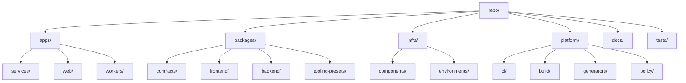
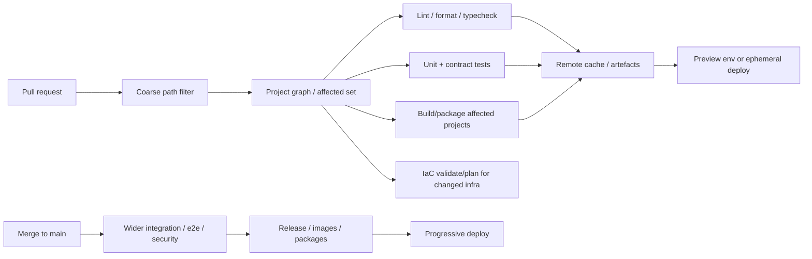

# Best Monorepo Project Structure for Polyglot Teams

## Executive summary

The best monorepo structure is **not** a folder naming exercise. The strongest evidence from Google, Meta, and the modern monorepo toolchain points to a deeper pattern: monorepos scale when the repository has a **first-class dependency graph**, **private-by-default boundaries**, **clear ownership**, **trunk-based workflows**, and **automated build/test/release policy**. Google’s published monorepo and codebase research emphasises a shared source of truth, visibility, atomic cross-project changes, ownership, and strong build tooling; Google’s case study also makes the counterpoint explicit that multi-repo setups still offer advantages in access control, stability, and per-team toolchain flexibility. Meta’s Buck2 documentation makes the same point from a different angle: the monorepo is valuable, but only if the build/runtime systems understand it. citeturn30view0turn30view1turn29view0turn29view1turn29view2turn31search1turn31search4

For the environment you described — backend services in **Go, Java, and Node**, frontend applications in **React and Angular**, plus **shared libraries, IaC, docs, and tests** — my opinionated default recommendation is a **hybrid monorepo**: keep **native leaf build tools** for each ecosystem, but add **one repo-level orchestration layer**. In practice that means **Nx as the default root orchestrator** for most small-to-large organisations, layered over **pnpm**, **Gradle**, and **Go modules/workspaces**. Move to **Bazel** only when cross-language build determinism, hermeticity, remote execution, and visibility enforcement become dominant constraints rather than nice-to-haves. Nx is compelling here because it is explicitly positioned for polyglot monorepos, supports graph-based affected runs and caching, and has official integrations for Gradle and Maven; Bazel is stronger on reproducibility and strictness, but materially more expensive to adopt. citeturn22search9turn22search2turn22search10turn22search7turn22search3turn22search8turn29view0turn37view1turn37view2turn37view3

The concrete structure I recommend is:

- **Deployables first**: put runnable applications and services in `apps/`
- **Reusable code second**: put shared libraries, SDKs, contracts, design tokens, and build presets in `packages/`
- **Platform and policy at the root**: keep CI, generators, build presets, scripts, policy checks, and engineering tooling in `platform/`
- **IaC split by lifecycle**: foundational infra centralised under `infra/`, but service-specific runtime manifests kept near each deployable when possible
- **Docs as code**: central `docs/`, plus a required `README` in every project
- **Tests close to code by default**, with only cross-project end-to-end and system tests centralised under `tests/` citeturn11search22turn25search21turn3search23turn29view2

For dependency and release strategy, the least painful model is **hybrid**. Inside the monorepo, prefer **live-at-head source dependencies** for first-party code instead of synthesising fake semver discipline for everything; Google’s dependency-management guidance explicitly argues that, all else equal, source-control problems are easier and cheaper than dependency-management problems. At the release boundary, however, version independently: **services ship independently**, **public packages version independently or in release groups**, and **lockstep versions are reserved only for tightly coupled frameworks or package families**. For JS packages, pnpm itself points users to **Changesets** or **Rush** for workspace versioning; Nx Release also supports independent releases and release groups. citeturn29view3turn35view0turn15search0turn15search3turn15search6turn24search5

If I reduce the entire report to one sentence, it is this: **structure the repo around ownership and deployability, enforce architecture with the build graph, and let release/version boundaries exist only where they create external value**. citeturn30view1turn29view2turn37view1turn15search2

## What the evidence actually says

The academic and industry evidence is more consistent than the monorepo debates often suggest. Google’s 2018 ICSE case study found that the biggest advantages of a monolithic repository are **codebase visibility**, **API discovery/reuse**, **automatic dependent updates during migrations**, and **centralised dependency management**. The same paper also found that multiple-repository systems retain meaningful benefits in **access control**, **stability**, and **toolchain choice**. A multivocal literature review reached a similar conclusion: monorepos simplify dependency management and cross-project change coordination, but only when the repository shares common tooling and practices. A more recent empirical study of Bazel in CI adds an important operational lesson: advanced build tech can produce large speedups, but many teams fail to realise those gains because they do not wire the build system properly into CI. In other words, a monorepo without graph-aware automation is often just a big repo. citeturn30view1turn16search18turn23academia12

Google’s own software-engineering guidance explains why build tooling is so central. A modern build system should optimise for **speed** and **correctness**, and it should be integrated with automated presubmit testing and trunk validation. Google also explicitly calls trunk-based development a highly scalable policy approach. Ownership is likewise not an afterthought: Google’s OWNERS model assigns stewardship hierarchically and has scaled across billions of lines of code. That combination — build graph, trunk, owners, and automation — is the real “project structure” that matters at scale. citeturn29view0turn29view1turn29view2

Open-source monorepos that actually work at scale exhibit convergent patterns:

| Repository | Observable structure | What it teaches |
|---|---|---|
| **Angular** | Uses `packages/`, `integration/`, `tools/`, `third_party/`, Bazel files such as `BUILD.bazel`, `MODULE.bazel`, and `pnpm-workspace.yaml`. citeturn27view0 | Mature framework repos separate product packages, integration suites, tooling, and third-party concerns. |
| **Kubernetes** | Uses `api/`, `cmd/`, `pkg/`, `staging/`, `test/`, `hack/`, plus `OWNERS`, `go.mod`, and `go.work`. citeturn26view0 | Large Go monorepos tend to distinguish APIs, commands, internal packages, staging/public surfaces, and contributor tooling. |
| **Azure SDK for JavaScript** | Uses `sdk/`, `eng/`, `documentation/`, `design/`, `samples/`, `pnpm-workspace.yaml`, and `turbo.json`. It also distinguishes generated versus handcrafted libraries in contribution guidance. citeturn26view2turn7view3 | Large package monorepos benefit from a clear separation between product packages, engineering system, documentation, design, and generated code. |
| **Nx** | Uses `packages/`, `tools/`, `examples/`, `CODEOWNERS`, and mixed toolchain files including Gradle and Maven wrappers. citeturn26view1 | Even monorepo tools themselves keep product code, samples, tooling, and ownership explicit. |
| **Rushstack** | Uses `apps/`, `repo-scripts/`, `rigs/`, `rush-plugins/`, `webpack/`, and `rush.json`. citeturn10view2 | Large JS package monorepos often promote build rigging and reusable engineering tooling to top-level citizens. |

The practical synthesis is straightforward: **successful monorepos are explicit about three things at the root** — product code, engineering system, and governance. They do not bury build logic inside application folders, and they do not rely on folder names alone to maintain architecture. citeturn27view0turn26view0turn26view2turn10view2turn29view2

## Recommended reference architecture

My default blueprint for your scenario is a **single repository with domain-owned deployables, reusable packages, a root engineering platform layer, and explicit infrastructure boundaries**. I would optimise the topology around **ownership first**, **deployability second**, and **language third**. That means React and Angular apps should sit next to backend services as first-class deployables; shared contracts and SDKs belong in reusable package areas; and build/policy/CI logic belongs at the top level, not hidden in the first app that happened to need it. That recommendation is a synthesis of the source patterns above, especially Angular, Kubernetes, Azure SDK JS, Rushstack, Google OWNERS, and Google’s build/dependency guidance. citeturn27view0turn26view0turn26view2turn10view2turn29view0turn29view2turn29view3



The diagram above is intentionally boring — and that is a feature. The root should be obvious to every engineer, every CI workflow, and every search/query tool. The build graph and ownership layer will carry most of the sophistication; the folder model should stay readable. citeturn29view0turn29view2turn22search10turn23search3

**Small-team variant**

```text
repo/
  apps/
    web-admin/                 # React app
    ops-console/               # Angular app
    api-gateway/               # Node service
    billing-service/           # Go service
    ledger-service/            # Java service
  packages/
    contracts/
      openapi/
      protobuf/
    frontend/
      design-tokens/
      icons/
      api-client-ts/
    backend/
      auth-lib-go/
      observability-java/
      config-node/
    tooling-presets/
      eslint-config/
      tsconfig/
  infra/
    terraform/
    kubernetes/
  platform/
    ci/
    scripts/
  docs/
  tests/
```

Use this when the team is still small enough that **asset-type grouping** is clearer than domain grouping. It matches the mental model of popular open-source monorepos such as Angular, Azure SDK JS, and Nx itself: `apps` or product areas, `packages`, and a distinct place for engineering tooling. citeturn27view0turn26view2turn26view1

**Medium-organisation variant**

```text
repo/
  domains/
    billing/
      apps/
        billing-api-go/
        billing-worker-java/
        billing-console-react/
      packages/
        billing-sdk-ts/
        billing-client-go/
        billing-model-java/
      docs/
    identity/
      apps/
        identity-api-node/
        admin-angular/
      packages/
        identity-sdk-ts/
        identity-client-go/
      docs/
  shared/
    contracts/
      protobuf/
      openapi/
      jsonschema/
    frontend/
      design-tokens/
      icons/
    platform-libs/
      logging/
      feature-flags/
  infra/
    components/
    environments/
      dev/
      staging/
      prod/
  platform/
    build/
    ci/
    generators/
    policy/
  docs/
  tests/
```

This is the best long-term default for most companies. It puts **ownership and change cadence** where they belong: within product domains. It also keeps cross-cutting assets explicit under `shared/`, which is where contracts, design tokens, and platform libraries belong. Microsoft’s guidance on layered provisioning for monorepos aligns with splitting infrastructure into components with different lifecycles, and Google’s ownership guidance strongly supports directory structures that map cleanly to stewards. citeturn3search23turn29view2

**Large-organisation variant**

```text
repo/
  domains/
    billing/
    identity/
    payments/
    fulfilment/
    analytics/
  shared/
    contracts/
    design-system/
    language-libs/
    generated/
  platform/
    build/
    ci/
    devex/
    golden-paths/
    security/
    policy/
  infra/
    foundation/
    service-runtime/
    environments/
  third_party/
  docs/
    adr/
    runbooks/
    standards/
  tests/
    cross-domain/
    performance/
    resilience/
```

At large scale, the physical layout should stay broadly similar, but the **enforcement model** changes. This is where I would consider mapping top-level areas onto **Bazel visibility domains or cells**, **Nx tags and conformance rules**, or **Rush subspaces** if dependency divergence inside JS becomes unavoidable. Buck2 explicitly notes that cells were originally intended to aid migration from differently configured repositories into a monorepo; Rush subspaces allow multiple lockfiles in one workspace; Bazel visibility and package groups support private-by-default boundaries. citeturn31search7turn24search3turn37view1

A few structure rules matter more than the exact folder names:

- **Do not share cross-language source code.** Share **contracts**, **schemas**, **IDLs**, and **generated clients**. Azure SDK JS explicitly separates generated and handcrafted libraries; that is the right instinct for a mixed Go/Java/Node stack as well. citeturn7view3
- **Keep service runtime manifests near the service when the lifecycle is service-specific**, but keep foundational infra such as networking, clusters, and shared data stores under central `infra/` layers. Microsoft’s layered provisioning guidance strongly supports this lifecycle split. citeturn3search23
- **Require one local README per project** and give docs owners. Google’s docs guidance argues that treating docs like code and giving them owners makes them maintainable. citeturn11search22turn25search21
- **Make dependency visibility private by default.** Public libraries should be deliberate exceptions, not the default state. Both Bazel and Google’s own practice say the same thing. citeturn37view0turn37view1

## Build systems, dependency strategy, and release model

The tool choice that matters most is the **repo-level orchestration layer**. For your stack, these are the realistic options:

| Layer | Tool | Evidence-backed strengths | Real cost | My verdict |
|---|---|---|---|---|
| Repo orchestrator | **Nx** | Polyglot monorepo build system; project graph; `affected` runs; computation hashing; remote caching; official Gradle and Maven support. citeturn22search9turn22search2turn22search10turn22search7turn22search3turn22search8 | Needs disciplined project metadata and target definitions. | **Best default** for most mixed-stack orgs. |
| Repo orchestrator | **Turborepo** | Excellent JS/TS task graph and caching; built on workspaces; package/task graph; `turbo prune` is useful for Docker/image slimming. citeturn14search22turn14search0turn14search8turn14search9 | Much weaker as the primary organiser of Go+Java-heavy repos. | Best when the repo is **mostly JS/TS**. |
| Repo orchestrator | **Rush** | Strong governance for large JS package repos: standard repo layout, preferred versions, consistent versions, change files, publish flow, build cache, phased builds, optional subspaces. citeturn3search0turn24search2turn24search19turn24search5turn3search6turn3search2turn24search3 | Mostly aimed at the JS package world, not full polyglot build correctness. | Use when you have **many publishable JS packages** and need strong package governance. |
| Repo orchestrator | **Bazel** | Strongest option for hermetic, correct, cross-language builds; strict visibility; deterministic version resolution via Bzlmod; remote cache and remote execution. citeturn29view0turn37view1turn37view2turn37view3turn4search17 | Highest migration and rule-authoring cost. | Use when **reproducibility, scale, and cross-language build graph** are top priorities. |
| Repo orchestrator | **Buck2** | Monorepo-native, multi-language, cells, visibility, remote execution; explicitly designed around large monorepos. citeturn31search1turn6search0turn6search1turn6search2turn31search4 | Public ecosystem and migration patterns are less broadly standardised than Bazel’s. | Strong specialist option, not my default general recommendation. |
| Leaf/native build | **Gradle** | Official multi-project and composite-build monorepo layouts, version catalogs, build cache, configuration cache. citeturn33view1turn33view0turn33view2turn33view3turn20search0 | JVM-centric; not enough alone for a repo-wide polyglot graph. | Keep as the **native JVM leaf build** even inside a larger monorepo. |
| Leaf/native build | **Go modules + `go.work`** | Native release boundary model for Go modules and good local multi-module development via workspaces. citeturn34view1turn34view0turn34view2 | `go.work` helps development, but it is not a replacement for repo-wide orchestration and release policy. | Keep as the **native Go leaf model**. |
| JS package manager | **pnpm** | Strong workspace model, strict `workspace:` protocol, one shared lockfile by default, catalog support, and explicit guidance to use Changesets or Rush for workspace versioning. citeturn35view0turn35view1 | Needs a companion release workflow tool. | **Default JS package manager** for this scenario. |

My recommendation, based on that comparison, is:

- **Small to medium, mixed stack**: **Nx + pnpm + Gradle + Go modules/workspaces**
- **JS-heavy product/app company**: **Turborepo or Nx + pnpm**
- **Many JS packages with strong publishing discipline**: **Rush + pnpm**, optionally with Nx-style graph tooling only if clearly needed
- **Large polyglot platform organisation**: **Bazel**, with native ecosystem tools still available for local developer ergonomics where sensible citeturn22search9turn35view0turn33view1turn34view0turn37view2turn37view3

The dependency/versioning decision is even more important than the root folders. The cleanest model for mixed monorepos is **hybrid versioning**:

| Model | Best use case | Advantages | Costs | Recommendation |
|---|---|---|---|---|
| **Fixed / lockstep version** | Tightly coupled framework packages or plugin families | Simple mental model; easy compatibility story; one release note stream. Nx itself releases `nx` and `@nx/*` in lockstep. citeturn15search6 | Over-releases unrelated packages; creates artificial coupling. | Only for **truly coupled packages**. |
| **Independent versions** | Libraries or SDKs with genuinely separate release cadences | Smaller releases; less churn; clearer ownership. Nx Release explicitly supports independent project releases. citeturn15search0turn15search3 | Harder dependency updates and compatibility management. | Good for **public packages** and **loosely coupled SDKs**. |
| **Live-at-head internally, versioned at the boundary** | First-party code inside one repo | Minimises internal dependency-management overhead; Google explicitly recommends preferring source-control problems over dependency-management problems where possible. citeturn29view3 | Requires strong CI and trunk discipline. | **Use this inside the repo** for first-party source dependencies. |
| **Hybrid** | Mixed services + packages + shared libs | Internal simplicity with external clarity; release groups only where justified. pnpm, Nx Release, Rush, Changesets, and Release Please all support parts of this model. citeturn35view0turn15search3turn24search5turn28search12turn28search2 | Slightly more policy thinking up front. | **My recommended default**. |

That leads to a more concrete policy set:

For **backend services**, version and deploy **per service**. Do not tie a Go API service, a Java worker, and a Node gateway into one repository-wide service version. For **internal shared code**, use source references in the monorepo rather than pretending every internal change needs published semver. For **public NPM or SDK packages**, use **independent versions** or **release groups**. For **deeply coupled package families** such as a design-system package set, lockstep is acceptable. citeturn29view3turn15search0turn15search3turn15search6

Per ecosystem, I would apply the following defaults:

- **JavaScript/TypeScript**: use **pnpm** workspaces, require the `workspace:` protocol for internal deps that must resolve locally, and centralise common dependency versions with **pnpm catalogs**. Start with a **single shared lockfile** because pnpm documents clear advantages: singleton dependencies, faster installs, and fewer lockfile review diffs. Only introduce multiple lockfiles later via **Rush subspaces** if the monorepo becomes large enough and dependency divergence becomes operationally painful. citeturn35view0turn35view1turn24search3
- **Java/JVM**: keep **Gradle** as the native build. Use **multi-project builds** when projects are intentionally built together, and **composite builds** during migration or where teams still want some isolation. Use **version catalogs** to centralise requested versions, but remember Gradle explicitly says catalogs do not enforce those versions by themselves. citeturn33view1turn33view0turn33view2
- **Go**: model a Go module as a unit that is “released, versioned, and distributed together”, because that is literally how the Go module system is defined. From that, my recommendation is to create **one Go module per independently releasable boundary**, not one module per package and not necessarily one mega-module for the whole repo. Use `go.work` for local cross-module development. That is an inference from the Go module model, but it is the cleanest one. citeturn34view1turn34view0

## CI/CD, testing, caching, and developer experience

The right CI model for a monorepo is **graph-first, not path-first**. Use path filters only as a coarse gate to avoid waking obviously irrelevant workflows; once the workflow runs, compute the affected project set from the **project graph**. GitHub path filters only understand file paths. Nx `affected` understands project boundaries and dependency propagation. Bazel `query` and `cquery` understand the build graph. That is a crucial distinction in monorepos because a one-line change in a shared contract or platform library can affect many projects that simple path matching will not reason about semantically. citeturn19search0turn38search11turn22search2turn23search3turn23search4



The first pipeline template below is what I would use for the **default Nx hybrid model**. It deliberately combines reusable workflows, dependency caching, OIDC-based cloud access, and affected-only execution. GitHub supports reusable workflows through `workflow_call`, dependency caching through cache keys, and OIDC so workflows can authenticate to cloud providers without long-lived secrets. Nx supports affected-only runs and remote caching, which is where most monorepo CI savings come from in practice. citeturn38search1turn38search3turn19search1turn38search4turn22search2turn22search7

```yaml
# .github/workflows/pr.yml
name: pr

on:
  pull_request:
    paths:
      - 'apps/**'
      - 'packages/**'
      - 'infra/**'
      - 'platform/**'
      - 'docs/**'
      - '.github/workflows/**'

jobs:
  affected:
    uses: ./.github/workflows/reusable-affected.yml
    with:
      base_ref: origin/main
      head_ref: ${{ github.sha }}
```

```yaml
# .github/workflows/reusable-affected.yml
name: reusable-affected

on:
  workflow_call:
    inputs:
      base_ref:
        required: true
        type: string
      head_ref:
        required: true
        type: string

jobs:
  build-test:
    runs-on: ubuntu-latest
    permissions:
      contents: read
      id-token: write   # needed for OIDC-based cloud auth if deploy/plan steps run
    steps:
      - uses: actions/checkout@v4
        with:
          fetch-depth: 0

      - uses: actions/setup-node@v4
        with:
          node-version: 22

      - name: Restore package-manager caches
        uses: actions/cache@v4
        with:
          path: |
            ~/.pnpm-store
            ~/.gradle/caches
            ~/.cache/go-build
            ~/go/pkg/mod
          key: mono-${{ runner.os }}-${{ hashFiles('pnpm-lock.yaml', '**/*.gradle*', '**/go.sum') }}

      - name: Install JS dependencies
        run: pnpm install --frozen-lockfile

      - name: Validate affected projects
        run: |
          pnpm nx affected -t lint,test,build \
            --base=${{ inputs.base_ref }} \
            --head=${{ inputs.head_ref }}

      - name: Validate infrastructure
        run: |
          pnpm nx affected -t infra-validate \
            --base=${{ inputs.base_ref }} \
            --head=${{ inputs.head_ref }}
```

For **Bazel-first organisations**, the CI template should be simpler because the build graph is already the source of truth. The critical step is enabling remote caching or remote execution correctly, because Bazel’s own docs and the recent empirical study both show that the benefits depend on proper CI wiring. citeturn37view3turn4search17turn23academia12

```yaml
# .github/workflows/bazel-pr.yml
name: bazel-pr

on:
  pull_request:

jobs:
  bazel:
    runs-on: ubuntu-latest
    steps:
      - uses: actions/checkout@v4

      - name: Build and test changed targets
        run: |
          bazelisk test //... \
            --config=ci \
            --remote_cache=${REMOTE_CACHE_URL}
```

On testing strategy, I would use five layers:

- **fast deterministic checks**: format, lint, typecheck, unit tests
- **contract checks**: API/schema compatibility and client generation validation
- **service integration tests**: per project or per domain
- **cross-domain end-to-end tests**: centralised and much fewer in number
- **nightly/system tests**: resilience, performance, and full-graph sweeps

The key rule is to cache only what is genuinely deterministic. Bazel remote caching assumes reproducible builds. Gradle’s build cache documentation likewise assumes tasks declare their inputs/outputs correctly and explicitly recommends CI-populated remote caches. Turborepo’s environment handling also exists because task caching becomes invalid when undeclared environment influence leaks in. My recommendation, therefore, is: cache **builds, code generation, lint, unit tests, contract tests, and deterministic integration tests**; do **not** cache flaky E2E, time-sensitive tests, or anything that reaches mutable shared environments. citeturn37view3turn33view3turn20search14turn14search10

Developer experience is where many monorepos quietly fail. The repository should have one clear bootstrap path, ideally a **single top-level bootstrap command** that installs tools and validates the environment. For Node-based roots, npm supports `packageManager` and `devEngines` metadata that can enforce the expected runtime/package-manager environment. Large repos should also support **sparse checkouts** and **partial clones** so engineers do not need the whole working tree on day one. Meta’s Sapling story exists because source-control ergonomics become existential at monorepo scale; Git’s sparse-checkout and partial-clone features are the pragmatic public equivalents for many teams. citeturn36view1turn32search0turn32search1turn32search4turn31search5

A good local-dev checklist looks like this:

- `./bin/bootstrap` or `make bootstrap` to install/update pinned tools
- **Gradle wrapper** for JVM builds
- **pnpm** as the only JS package manager
- `go.work` for local multi-module Go workflows
- optional `git clone --sparse --filter=blob:none` for very large repos
- repo-level commands such as `pnpm nx graph`, `pnpm nx affected`, or `bazel query` so engineers can inspect impact before merging citeturn33view1turn34view0turn32search4turn22search2turn23search3

## Migration, governance, and anti-patterns

The safest migration from multi-repo is **incremental composition first, consolidation second**. Do not rewrite every build system on day one. Gradle’s composite builds explicitly support an “uber-root” monorepo layout that knits together independent builds; Go workspaces let you work across multiple modules without rewriting them into one module; Buck2 cells were originally intended to help combine repositories with different setups into one monorepo; Rush has an explicit maintainer tutorial for consolidating separate projects into a new repo. Those are strong signals to migrate by **federating existing working builds into a root workspace**, then tightening standards over time. citeturn33view0turn34view0turn31search7turn24search12

My migration checklist is:

1. **Inventory current repos by deployable, library, owner, release cadence, and runtime.** Migration should preserve these boundaries before it tries to optimise them. citeturn30view1turn29view2
2. **Choose the future root taxonomy up front** — whether `apps/packages/platform/infra` or `domains/shared/platform/infra`. Change this once, not every quarter. citeturn27view0turn26view2turn10view2
3. **Create a temporary umbrella build/workspace** using the least invasive native composition mechanism available: Gradle composite builds, Go `go.work`, pnpm workspaces, or Buck2 cells. citeturn33view0turn34view0turn35view0turn31search7
4. **Land root-level standards before bulk imports**: formatter, linter, package manager, ownership model, CI entry points, and docs expectations. citeturn29view2turn11search22turn36view1turn13search0
5. **Import leaf projects first**, especially services with clear build and deploy boundaries. Delay deeply shared libraries until the root graph is visible.
6. **Turn on affected-only CI and remote caches early**, because this is when the repo starts becoming operationally better rather than merely larger. citeturn22search2turn22search7turn37view3turn33view3
7. **Move shared contracts next**, and generate language-specific clients instead of forcing cross-language source sharing. citeturn7view3
8. **Migrate release automation only after build/test parity**. pnpm workspaces do not ship a built-in release system; use Nx Release, Changesets, Rush, or Release Please once the dependency graph is stable. citeturn35view0turn15search3turn28search12turn24search5turn28search2
9. **Freeze old repos read-only after a soak period**. Avoid dual-write phases longer than necessary.
10. **Add architectural enforcement last but decisively**: tags, visibility, code owners, sensitive-path protections, and release group policy. citeturn15search2turn15search7turn37view1turn13search0turn12search18

Governance should be **encoded**, not tribal. On GitHub, use **CODEOWNERS** and **rulesets** so sensitive areas such as `.github/workflows`, `platform/build`, `infra/environments/prod`, and `packages/contracts` require the right reviewers and status checks. GitHub’s security guidance explicitly recommends using CODEOWNERS to monitor workflow-file changes. Nx Enterprise can compile project/file ownership settings into CODEOWNERS and can enforce workspace-wide conformance rules. Bazel can enforce a similar architecture through default-private visibility and package groups. If you are on Azure Repos instead of GitHub, the analogous mechanism is **branch policies** with required reviewers. citeturn13search0turn12search2turn12search10turn13search6turn15search14turn15search7turn37view1turn12search3turn12search11

The monorepo anti-patterns I would avoid most aggressively are these:

| Anti-pattern | Why it fails | Better pattern |
|---|---|---|
| **A root `apps/` + `libs/` split with no tags, no owners, and no visibility rules** | The folders look organised but nothing prevents architectural drift. citeturn15search2turn37view1turn29view2 | Add tags/constraints, owners, and private-by-default library visibility. |
| **Path-only CI** | It cannot model transitive impact through shared packages or contracts. citeturn19search0turn22search2turn23search3 | Use path filters only to wake workflows; use the graph to compute affected projects. |
| **Lockstep versioning for unrelated services** | It creates artificial coupling and noisy releases. citeturn15search0turn29view3 | Version services independently; lockstep only tightly coupled package families. |
| **Multiple lockfiles too early** | It increases maintenance complexity and weakens the “single source of truth” benefit. pnpm defaults to one workspace lockfile, and Rush treats multiple lockfiles as an advanced capability. citeturn35view0turn24search3 | Start with one lockfile; introduce subspaces only when there is real pain. |
| **Hidden build logic in package hook scripts** | It makes builds opaque and can break monorepo orchestration. Azure SDK JS explicitly warns against hook scripts that install dependencies or compile implicitly. citeturn7view3 | Put build steps in explicit repo tasks/targets. |
| **Public-by-default shared libraries** | You lose control over architecture and create dependency sprawl. citeturn37view0turn37view1 | Make libraries private by default and whitelist consumers deliberately. |
| **Mixing generated and handwritten code with no boundary** | Ownership, regeneration, and review noise become unclear. citeturn7view3 | Separate `generated/` or service-scoped generated areas with clear regeneration commands and owners. |

My final, opinionated call is this: for your unspecified-but-clearly-polyglot environment, the strongest default is a **domain-aware hybrid monorepo** with **`apps/`, `packages/`, `infra/`, `platform/`, and `docs/` at the root; Nx as the repo-level graph/orchestration layer; pnpm for JS/TS; Gradle for JVM; Go modules with `go.work` for Go; CODEOWNERS plus rulesets; single-lockfile-by-default dependency policy; affected-only CI with remote caching; and hybrid release/version boundaries**. Reserve Bazel for the point at which native-tool composition is no longer good enough — not because Bazel is weak, but because the migration cost is only justified when hermeticity and cross-language correctness become first-order business needs. citeturn22search9turn22search2turn22search7turn35view0turn33view1turn34view0turn13search0turn12search10turn29view3turn37view2turn37view3