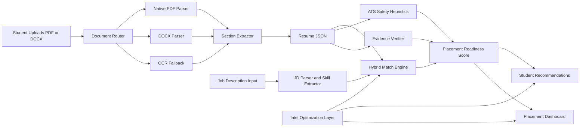
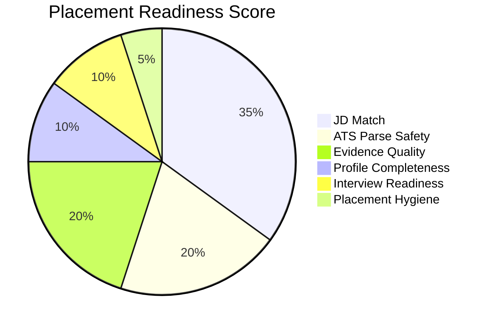
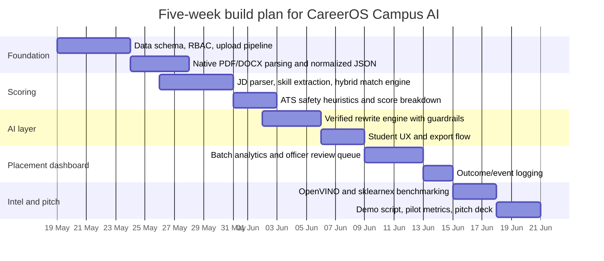

# CareerOS Campus AI

## Executive summary

CareerOS Campus AI should **not** be pitched as “an AI job platform for everyone.” That version is weak, crowded, and not bootcamp-friendly. It should be pitched as **an Intel-optimized placement-readiness engine for Indian colleges**: a system that helps students produce ATS-safe, job-matched resumes and helps placement cells manage readiness at the cohort level. That wedge is materially better because the underlying pain is real, measurable, and institutional. India had nearly **4.33 crore** higher-education enrolments in AISHE 2021–22, with **1.07 crore** pass-outs in that year, including **8.47 lakh** Bachelor of Engineering/B.Tech pass-outs; Engineering & Technology accounted for **11.8%** of undergraduate enrolment. At the same time, Mercer | Mettl’s 2025 India Graduate Skill Index reported that only **42.6%** of Indian graduates who apply for jobs are overall employable, and the ILO’s India Employment Report 2024 highlights that **educated youth face higher unemployment** and a clear **mismatch between aspirations, education, and available jobs**. citeturn6view0turn1search5turn40view0

The institutional workflow pain is also real. Official IIT placement documents show that resumes are often **proof-verified before approval**, students can apply only after approval, the office coordinates **resume submission deadlines, shortlists, tests, GDs, interviews, and offer management**, and mock interviews/readiness sessions are run as part of placement support. That means the placement problem is not just “students need better resumes”; it is also “placement cells are doing manual, repetitive, high-volume screening and coordination with poor analytics.” CareerOS Campus AI is strongest when it solves both sides together. citeturn11view3turn11view4turn11view0turn11view1turn10view1turn0search13

The harsh truth is this: **a full campus hiring platform is not feasible as a convincing 5-week bootcamp build unless the scope is brutally narrowed**. What is feasible is a sharp MVP with four visible capabilities: **resume ingestion and section extraction**, **JD match and ATS safety scoring**, **AI-guided resume fixing with no-fabrication guardrails**, and a **placement-officer batch dashboard** with Intel-backed local inference and measurable performance benchmarks. If you do that well, the project is strong. If you also try to build a full job board, recruiter CRM, LinkedIn sync, student social graph, interview simulator, and recruiter marketplace, the project becomes immature and easy to dismiss.

### Strict viability scorecard

| Dimension | Score | Strict note |
|---|---:|---|
| Problem severity | 9/10 | Big, obvious, evidence-backed problem in India |
| Demo potential | 9/10 | Very visual; easy before/after story |
| Intel fit | 9/10 | Strong if you visibly benchmark OpenVINO and sklearnex |
| Technical feasibility in 5 weeks | 7/10 | Good only if scope is cut hard |
| Campus buyer clarity | 7/10 | Placement cells and admins are plausible buyers, but sales cycles are long |
| Moat today | 4/10 | Weak without verified outcome data and campus workflow integration |
| Moat after pilot data | 8/10 | Stronger if you own outcome-linked readiness data |
| Risk of becoming “just another resume tool” | High | This is the core strategic danger |

### The single best positioning line

**CareerOS Campus AI is a placement-readiness operating layer for Indian colleges: it turns unstructured student resumes into ATS-safe, job-matched, cohort-level readiness intelligence, optimized to run fast on Intel hardware.**

## Problem definition and user journeys

The market problem is not “students need AI.” The problem is that **Indian fresher hiring is crowded, skill-signalling is weak, and campus placement workflows are still operationally manual**. AISHE data shows the scale of the transition challenge from college to work, while Mercer | Mettl and the ILO show that employability and labour-market matching are still major issues for educated youth. That is the structural case for CareerOS Campus AI. citeturn6view0turn1search5turn40view0

The ATS-specific problem is more concrete than most startup pitches admit. On real systems such as Greenhouse, resumes can fail or partially fail to parse because of **large files, graphics, photos, image-only uploads, headers/footers, complex tables, columned layouts, missing clear sections, and non-standard contact placement**. Indeed India and LinkedIn career guidance also recommend **standard headings, simple formatting, and role-specific keywords** because automated systems may miss data in headers/footers or struggle with overly decorative layouts. So the “ATS-safe” angle is not fluff; it is a real parsing and usability problem. citeturn13view0turn13view3turn13view2

Placement-office pain is even more pitch-worthy because it is operational and measurable. IIT Madras states that resume points are checked through an **elaborate verification process**, points without proof are not allowed, and students can join the placement process only after their resumes are approved. Recruiter-side workflow documents show the office or student PoCs coordinating **resume submission, pre-checks, shortlisting, tests, GDs, interviews, and offer handling**. IIT Kanpur’s policy makes the same basic point: the office facilitates placements but does not guarantee them, so readiness and process quality matter. That is exactly where a campus product can make itself useful. citeturn11view3turn11view4turn11view0turn11view1turn10view3turn10view1

### Core personas

| Persona | What they want | Current friction | What CareerOS Campus AI should do |
|---|---|---|---|
| Student | Know if a resume will pass ATS, match a JD, and improve shortlist chances | Resume formatting confusion, weak keyword alignment, generic bullets, no feedback loop | Upload resume, parse sections, get readiness score, apply verified AI fixes, export ATS-safe version |
| Placement officer | Approve resumes faster, identify weak cohorts, reduce manual checking | Proof verification overhead, inconsistent formats, poor visibility into department readiness, repeated student queries | Batch analytics, proof-linked review queue, readiness heatmaps, department/company fit reports |
| College admin/TPO head | Improve placement outcomes and justify training interventions | No aggregate intelligence, no longitudinal baseline, weak evidence for what improved outcomes | Outcome dashboard, training ROI, cohort trend views, exportable reports for committees and management |

### User journeys that matter

For the **student**, the best flow is: upload resume → parse into editable sections → run ATS safety checks → paste JD → get hybrid JD match and spotted gaps → apply only verified rewrite suggestions → export PDF/DOCX → track score deltas. This must feel immediate and brutally useful. If it takes too many clicks or reads like a “career blog in a box,” it loses.

For the **placement officer**, the critical journey is: upload a batch or enable student self-upload → see department-level readiness distribution → open review queue of low parse-safety / low evidence resumes → approve or return with tagged reasons → export company-specific shortlist-prep list → monitor improvement after interventions. This is where the product differentiates from consumer resume tools. The official campus placement documents support the fact that offices already run similar control points manually. citeturn11view3turn11view0turn10view1

For the **admin**, the journey is less frequent but more strategic: pick a department, company type, or graduating batch → view benchmark KPIs → identify systemic skill gaps → decide whether to run training, mock interviews, or company-specific workshops → measure whether scores and placement funnel metrics move afterwards. This is your eventual moat because it turns a resume tool into a campus intelligence layer.

## Competitive landscape

The competitive reality is unforgiving. Individual resume tools are abundant. Job portals are abundant. AI wording tools are abundant. What is scarce is a **college-native placement-readiness system** that combines resume parsing, ATS safety, JD matching, proof-linked review, cohort analytics, and outcome tracking. That is the hole CareerOS Campus AI should occupy.

### Comparative market view

| Tool | Core offer | Pricing signal | India fit | Why it matters | Why it is still not your product |
|---|---|---|---|---|---|
| **Jobscan** | ATS resume scanner, match-rate report, missing skills, builder, LinkedIn optimization | Premium plan shown at **$49.95** with unlimited scans and AI tools; free resume score and scanner available citeturn20search0turn29view0 | Medium | Mature ATS-oriented positioning and strong resume-vs-JD framing | Consumer tool; no campus workflows, no batch analytics, no proof verification, no placement-cell dashboard |
| **Rezi** | ATS resume checker, AI resume builder, LinkedIn import, formatting guardrails | **Free** checker; paid plans shown at **$29 monthly** and **$149 lifetime** citeturn29view2turn29view3 | Medium | Strong ATS-compatibility messaging and actionable formatting checks | Still candidate-first; weak institutional analytics and no campus operations layer |
| **Teal** | Resume builder, job tracker, keyword matching, AI bullets/summary, Chrome-based job tracking | **Free forever** core tier; premium shown at **$9/week** with unlimited keyword matching and analysis citeturn30view0turn30view1turn30view2 | Medium | Good orchestration of job search workflow, not just resume editing | Built for individual search management, not campus placement management |
| **ResumeGyani** | India-focused AI resume builder, ATS score checker, LinkedIn optimizer, Naukri score framing | Entry pricing starts at **₹199**; ATS score checker and India-focused tools emphasized citeturn20search3turn30view3turn20search11 | High | India-native messaging, fresher appeal, Naukri-oriented framing | Still mostly a resume optimizer, not a college operating system |
| **Naukri tools** | AI resume maker, resume score/quality, Naukri Pro AI attempts, Resume Display visibility | Resume maker is **free** with limits; Naukri Pro unlocks more AI attempts; Resume Display starts around **₹890/month** and Naukri says profile ranking matters because **over 70% of hiring activity is driven by CV search** citeturn31view3turn21search4turn21search11turn21search1 | Very high | Strong India distribution and recruiter visibility logic | Portal-centric. Great for profile visibility, weak for college-side workflow control and outcome analytics |
| **Internshala** | Student/fresher-focused resume builder, upload flow, internship/job discovery, recruiter search | Marketed as **free**; strongly student-focused citeturn33view0turn33view1turn33view3 | Very high | Strong fresher wedge and high trust among students/internship seekers | Optimized for self-serve student usage, not college placement-office operation |
| **Apna** | AI resume builder, job applications, India jobs platform, profile optimization | Blog positions the builder as **free**; platform markets **50 lakh+** opportunities and **5 crore+** active job seekers citeturn32view0turn32view2turn21search9 | Very high | Strong India mass-market footprint and recruiter role-title matching | Focused on job marketplace activity, not campus-readiness benchmarking |
| **Resumod** | ATS checker, AI builder, LinkedIn-to-resume, sample resume library, business resume parsing | Free + paid templates on main site; business offering includes parsing/building/analysis; pricing is not prominently surfaced on current core pages, though older official material mentions paid weekly plans citeturn37search1turn34view0turn34view1turn37search8turn37search0 | High | Interesting because it already spans consumer and business resume workflows | Still resume-centric; no college-specific workflow identity |
| **Hiration** | AI resume builder, resume review, interview practice, cover letters, LinkedIn optimizer | Free entry/no card; pricing snippet shows **$49.99 / 3 months** for a subscription plan citeturn34view2turn36search0turn36search1turn36search3 | Medium | Broad AI career platform, strong feature coverage | Too horizontal; weak campus wedge unless sold through career centers |
| **Shine Resume** | Resume builder, resume writing, resume score, application booster, Shine profile integration | Resume builder shown at **₹199**; resume writing **₹2199**; application booster **₹3099** citeturn34view3turn34view4turn34view5turn34view6 | High | Strong India pricing and profile-visibility upsell | Service-heavy and portal-adjacent; not a placement readiness intelligence system |

### What the table really says

The market is crowded on **templates**, **keywording**, and **AI bullet rewriting**. It is much less crowded on **institutional workflow**. None of the tools above is clearly built around the actual pain revealed in Indian placement documents: proof-linked verification, approval queues, shortlist readiness, intervention analytics, and department/company heatmaps. That is your wedge.

The most dangerous competitors are not the prettiest ones. They are the ones that already own **distribution** and **student habit** in India: Naukri, Internshala, and Apna. If CareerOS Campus AI becomes just a nicer resume checker, it loses. If it becomes the **system colleges use to manage placement readiness**, it has a credible reason to exist.

## Product architecture and scoring design

### Product scope that should be built

The MVP should include only four product surfaces.

The **student surface** should handle resume upload, section extraction, ATS risk checks, JD paste/upload, score breakdown, verified AI fixes, and clean export. The **placement-officer surface** should show batch readiness, review queues, skill-gap analytics, and department filters. The **admin surface** should show longitudinal outcome and training ROI views. The **benchmark surface** should show Intel speedups clearly enough that a bootcamp judge can understand the technical differentiation without reading your codebase.

Everything else is secondary.

### Product scope that should be cut

Do **not** build a recruiter marketplace. Do **not** make LinkedIn import or unofficial scraping a core dependency. Do **not** build a full interview copilot in week one. Do **not** build a public job board. Do **not** try to support every document language and exotic layout perfectly on day one. Do **not** promise “guaranteed placements.” Those are all credibility killers.

### Recommended system design



### Recommended build stack

| Layer | Recommendation | Why this choice | Alternatives |
|---|---|---|---|
| Frontend | Next.js + TypeScript | Rapid dashboarding, SSR/CSR flexibility, strong developer velocity | React + Vite if you want lighter setup |
| API layer | FastAPI | Strong Python-native fit for parsing/ML pipelines; type validation and auto docs are built in citeturn28search8turn28search4 | Node/NestJS if your team is JS-heavy, but Python will still be needed for parsing/ML |
| Database | PostgreSQL + `jsonb` | Colleges need relational integrity for users/outcomes plus semi-structured storage for parses, recommendations, and model traces; PostgreSQL officially supports `json` and `jsonb` for efficient querying citeturn28search1 | MongoDB if you want schema flexibility, but outcomes/reporting will get messy |
| Queue / background jobs | Redis Streams | Good fit for append-only event logs and worker consumption patterns citeturn28search2turn28search18 | RabbitMQ/Celery, or simple Postgres jobs if the MVP is very small |
| PDF export | WeasyPrint | Converts HTML/CSS to PDF and supports print-style rendering well; it is a practical choice for ATS-safe exports, though untrusted file access must be locked down citeturn28search7turn28search23 | Headless Chromium/Puppeteer |
| Embeddings / NLP | Sentence Transformers + spaCy | Embeddings for semantic match; spaCy transformer component integrates with Hugging Face-style transformer pipelines citeturn18search19turn38view2 | Pure transformer stack without spaCy if you want fewer abstraction layers |
| Intel acceleration | OpenVINO + sklearnex + oneDAL | Strong Intel story with measurable gains on CPU-bound inference and analytics workloads citeturn18search4turn18search1turn18search2 | Plain PyTorch / stock scikit-learn, but weaker bootcamp differentiation |

### Suggested database schema

| Table | Key fields | Purpose |
|---|---|---|
| `colleges` | `id`, `name`, `state`, `type` | Multi-campus readiness later; single-campus now |
| `departments` | `id`, `college_id`, `name` | Department-level analytics |
| `users` | `id`, `role`, `email`, `college_id` | RBAC for students, officers, admins |
| `students` | `id`, `user_id`, `dept_id`, `grad_year`, `cgpa`, `backlogs` | Eligibility and cohort segmentation |
| `resumes` | `id`, `student_id`, `file_uri`, `source_format`, `text_hash`, `version` | Canonical upload record |
| `resume_sections` | `resume_id`, `section_name`, `content_json`, `confidence` | Structured output from parser |
| `resume_evidence` | `resume_id`, `claim_id`, `proof_uri`, `verified_by`, `status` | Proof-linked anti-fabrication layer |
| `job_descriptions` | `id`, `company`, `role`, `raw_text`, `skills_json`, `eligibility_json` | JD store |
| `scorecards` | `resume_id`, `jd_id`, `jd_match`, `ats_safety`, `evidence_quality`, `overall_score` | Repeatable evaluation record |
| `recommendations` | `scorecard_id`, `type`, `before_text`, `after_text`, `evidence_linked` | Explainable suggestions |
| `applications` | `student_id`, `jd_id`, `status`, `shortlisted_at`, `interviewed_at`, `offer_status` | Funnel tracking |
| `outcomes` | `student_id`, `placed`, `company`, `ctc_band`, `joined` | Outcome moat |
| `events_audit` | `actor_id`, `action`, `target_id`, `timestamp` | Accountability, privacy, and debugging |

### Resume parsing and section extraction

The correct parsing strategy is **not one parser to rule them all**. Use a router.

For **machine-generated PDFs**, `pdfplumber` is a strong first-line choice because it gives access to detailed PDF objects, text, and table extraction, and explicitly works best on machine-generated rather than scanned PDFs. For **DOCX**, `python-docx` is useful because it treats paragraphs and tables as block-level objects, which is practical when reconstructing section order. If you need broad file-type coverage later, Apache Tika is useful because it extracts text and metadata from **over a thousand file types**, but its PDF text ordering needs care: its own PDF parser docs state that sorting text by position can help some files but can also **interleave two-column PDFs incorrectly**. citeturn38view0turn38view1turn38view5turn39view0

For **scanned or image-heavy resumes**, use an OCR branch. PaddleOCR’s layout analysis stack is materially stronger than plain OCR because it is designed to detect document elements such as paragraphs, headings, tables, formulas, and reading order. Tesseract is a reasonable fallback, but its official docs state that it **does not read PDF input directly**; PDFs must be converted first or handled via another tool. citeturn38view4turn38view6

A practical extraction pipeline is:

1. Determine file type and text density.
2. If native PDF with extractable text, parse with `pdfplumber`.
3. If DOCX, parse with `python-docx` and normalize tables/paragraphs.
4. If low text density or image-only, convert pages to images and use PaddleOCR layout + OCR fallback.
5. Normalize into a standard schema with candidate sections such as `summary`, `education`, `experience`, `projects`, `skills`, `positions_of_responsibility`, `certifications`, `achievements`, and `links`.

The smart part is the **section extractor**, not the raw parser. Build it as a hybrid of **heading heuristics**, **layout signals**, and **entity extraction**. Rule dictionaries should understand Indian fresher resume patterns such as **CGPA**, **X/XII**, **backlogs**, **POR**, **hackathons**, **GitHub/LeetCode/CodeChef**, and role-specific projects. A spaCy transformer pipeline can help with named entities and span tagging, while fallback rules should remain in place because fresher resumes are often semi-structured and inconsistent. citeturn38view2

### Recommended parsing tradeoff matrix

| Method | Best use | Strength | Weakness |
|---|---|---|---|
| `pdfplumber` | Native PDFs | Great control over text/table/layout extraction | Weak on scanned/image resumes |
| `python-docx` | DOCX resumes | Reliable structure for paragraphs/tables | Needs extra logic for complex embedded objects |
| Apache Tika | Broad format support | Very wide file coverage | Reading-order issues on some PDFs; not ideal as sole parser |
| PaddleOCR layout + OCR | Scanned or photo resumes | Stronger layout-aware recovery | Heavier runtime cost |
| Tesseract fallback | Cheap OCR backup | Simple and mature | Lower quality on messy layouts; no direct PDF input |

### Hybrid JD match and scoring model

Your scoring should be explainable and visibly modular. A black-box “AI score” is weak. A score that decomposes into **lexical fit**, **semantic fit**, **skill recall**, **eligibility fit**, **ATS safety**, and **evidence quality** is strong.

Use `TfidfVectorizer` to compute sparse lexical overlap, then use cosine similarity on both sparse vectors and dense embeddings. This is academically boring, but that is exactly why it is good for a bootcamp: it is stable, understandable, and benchmarkable. Scikit-learn explicitly documents both TF-IDF vectorization and cosine similarity, while Sentence Transformers explicitly supports semantic textual similarity through embeddings and similarity functions. citeturn17search0turn17search1turn17search2turn18search19

A strong JD match formula is:

```text
JD_Match
= 0.35 * TFIDF_Cosine
+ 0.35 * Embedding_Cosine
+ 0.20 * Required_Skill_Recall
+ 0.10 * Eligibility_Rule_Score
```

Where:

- `TFIDF_Cosine` rewards direct keyword/phrase overlap.
- `Embedding_Cosine` catches semantic similarity and phrasing variation.
- `Required_Skill_Recall` is the fraction of required JD skills explicitly found in resume sections.
- `Eligibility_Rule_Score` checks branch/year/CGPA/backlogs/location or any hard filters.

Then compute the broader **Placement Readiness Score**:

```text
Placement_Readiness_Score
= 0.35 * JD_Match
+ 0.20 * ATS_Parse_Safety
+ 0.20 * Evidence_Quality
+ 0.10 * Profile_Completeness
+ 0.10 * Interview_Readiness
+ 0.05 * Placement_Hygiene
```

Where:

- `ATS_Parse_Safety` = format and parser survivability
- `Evidence_Quality` = bullets with measurable impact + proof-linked claims
- `Profile_Completeness` = missing/null sections, links, dates, education fields
- `Interview_Readiness` = mock interview completion, aptitude readiness, communication checklist
- `Placement_Hygiene` = naming, file size, export quality, role consistency



### ATS-parse safety heuristics

This layer should be brutally deterministic. It is one of the easiest places to create visible value.

Penalize or flag:

- Multi-column layout
- Contact info in header/footer/text box
- Tables used for core content
- Images, logos, icons, word art, or photo-heavy design
- Missing standard section headings
- Non-standard date formats
- Scanned/image-only resume without text layer
- File size above safe thresholds
- Incomplete job titles
- Missing company or college names
- Unclear section ordering

These are not random preferences. Greenhouse explicitly lists many of these as causes of unsuccessful parsing, including large files, graphics/photos, image uploads, complex tables, headers/footers, columns, and unclear sections. LinkedIn and Indeed India also recommend standard headings, one-column layouts, simple formatting, and keyword alignment. citeturn13view0turn13view2turn13view3

A practical penalty model:

```text
ATS_Parse_Safety = 100 - sum(penalties)

penalties:
- 12 points: two-column layout
- 10 points: contact in header/footer/text box
- 10 points: heavy table-based layout
- 8 points: images/icons/logo
- 8 points: scanned image with no OCR text layer
- 6 points: missing standard headings
- 5 points: non-standard dates
- 5 points: oversized file
- 4 points: partial parse / missing key fields
- 4 points: incomplete titles or employer/college names
```

### AI resume-fixer design and guardrails

This part can make or break trust.

The fixer should **never** rewrite directly from raw free text plus a JD and “hope for the best.” It should operate only on a **structured resume JSON**, a **structured JD JSON**, and a **verified evidence set**. It should produce **section-level rewrite suggestions**, not silent document rewrites. And it should return output through a **JSON schema**, not unstructured prose. Structured-output support exists in both OpenAI’s and Anthropic’s current platform docs, and Anthropic explicitly recommends XML-style prompt structure for complex prompts. citeturn27search3turn27search11turn27search0turn27search2

#### Non-negotiable guardrails

The model must not:

- Invent internships, projects, tools, percentages, or certifications
- Change CGPA, exams, dates, companies, or titles without user confirmation
- Add “worked on AI/ML” if the evidence only shows coursework
- Inflate role scope from “team member” to “team lead”
- Replace weak evidence with fabricated metrics

The model should:

- Prefer **rewrite** over **generation**
- Refuse unsupported quantification
- Attach each suggestion to source evidence IDs
- Return confidence and risk tags
- Preserve Indian academic context where useful, such as CGPA and X/XII formatting

#### Sample system prompt

```xml
<system>
You are a placement-readiness resume editor for Indian college students.
Your job is to improve ATS safety and JD fit without fabricating facts.

Hard rules:
- Use only facts present in <resume_json> and <evidence_json>.
- Never invent metrics, tools, certifications, team size, or ownership.
- If a bullet lacks measurable evidence, improve clarity but do not quantify.
- Keep output ATS-safe: no tables, icons, columns, or decorative language.
- Preserve Indian education context when relevant: CGPA, X/XII, semester, backlog.
- Return valid JSON matching the schema exactly.
</system>

<context>
<job_description_json>{{JD_JSON}}</job_description_json>
<resume_json>{{RESUME_JSON}}</resume_json>
<evidence_json>{{EVIDENCE_JSON}}</evidence_json>
<ats_flags>{{ATS_FLAGS}}</ats_flags>
</context>

<task>
Produce:
- summary of top issues
- rewritten bullets by section
- unsupported claims list
- ATS format fixes
- actions that require human confirmation
</task>
```

#### Output schema suggestion

```json
{
  "top_issues": [
    {"type": "ATS_FORMAT", "message": "Contact info detected in header", "severity": "high"}
  ],
  "section_rewrites": [
    {
      "section": "projects",
      "original": "Built a website using Python",
      "rewrite": "Built a Python-based web application for ___ using ___",
      "evidence_ids": ["proj_12"],
      "confidence": 0.81
    }
  ],
  "unsupported_claims": [
    {"claim": "Led a 5-member team", "reason": "No supporting evidence found"}
  ],
  "requires_confirmation": [
    {"field": "cgpa", "suggested_change": "Use 8.34 instead of rounded 8.3"}
  ]
}
```

### Batch analytics and dashboard metrics

This is the institutional moat. It should look like a placement command center, not a student hobby project.

| Metric | Why it matters | Target demo view |
|---|---|---|
| Parse-safe resume rate | Shows how many resumes are likely to survive ATS/autofill | By department, year, company bucket |
| Median Placement Readiness Score | Simple cohort health indicator | Batch trend line |
| Skill-gap heatmap | Tells departments what students are missing for target roles | Dept × skill family matrix |
| Required-skill recall by company type | Shows mismatch between student profiles and recruiter demand | IT services vs product vs analytics vs core |
| Resume approval turnaround time | Direct placement-office productivity metric | Officer ops panel |
| Shortlist conversion rate | Strongest near-term proof of usefulness | Pre/post intervention |
| Rewrite acceptance rate | Tells whether AI suggestions are genuinely helpful | Student product quality |
| Mock interview completion vs outcome | Ties readiness interventions to downstream results | Admin ROI view |

#### Sample dashboard mockup

```text
┌──────────────────────────────────────────────────────────────────────┐
│ Campus Placement Readiness Dashboard                                │
├──────────────────────────────────────────────────────────────────────┤
│ Avg Readiness: 63    Parse-Safe: 71%    Verified Resumes: 54%       │
│ Shortlist Rate: 18%  Approval SLA: 2.1 days                         │
├──────────────────────────────────────────────────────────────────────┤
│ Department Readiness                                                │
│ CSE 74   ECE 61   MECH 49   CIVIL 43   MBA 58                       │
├──────────────────────────────────────────────────────────────────────┤
│ Top Skill Gaps                                                      │
│ SQL ████████   DSA ██████   Excel █████   Aptitude ██████           │
├──────────────────────────────────────────────────────────────────────┤
│ Officer Queue                                                       │
│ 34 resumes need proof check                                         │
│ 19 resumes fail ATS safety                                          │
│ 12 students below company eligibility                               │
├──────────────────────────────────────────────────────────────────────┤
│ Company Targeting                                                   │
│ Infosys Fit 68 | TCS Fit 72 | Deloitte Fit 51 | Intel Fit 57        │
└──────────────────────────────────────────────────────────────────────┘
```

## Intel optimization and benchmarking

The Intel angle is real, but it has to be handled honestly. OpenVINO is an open-source toolkit for optimizing and deploying AI inference on Intel hardware, including CPU, GPU, and NPU, and supports models from common frameworks. Intel Extension for Scikit-learn dynamically patches scikit-learn estimators for acceleration, and oneDAL provides optimized analytics building blocks across preprocessing, modeling, and clustering. Intel’s published materials also show aggressive headline speedups in some workloads, but your bootcamp pitch should **not** lead with vendor-maximum numbers. It should lead with **your measured numbers on your pipeline and your dataset**. citeturn18search4turn18search8turn18search1turn18search9turn18search2turn18search14turn18search5

### Where Intel optimization genuinely helps

OpenVINO is most useful for **local embedding/classification inference**, such as:

- lightweight sentence-embedding model used for JD matching
- resume-section classifier
- rewrite-quality or ATS-risk classifier
- optional on-device reranker

Intel also provides a benchmark tool and a BERT benchmark sample specifically to measure inference speed and latency, so use those as part of your demonstration methodology. citeturn19search7turn19search1

sklearnex and oneDAL are most useful for **analytics workloads**, such as:

- KMeans clustering of students by skill profile
- PCA / dimensionality reduction for dashboards
- nearest-neighbour or similarity-heavy cohort analysis
- some classical classification/regression experiments

### Where Intel optimization will not magically save you

Be explicit about this.

- **PDF parsing** will not suddenly become “Intel-fast” in the same way inference does.
- **TF-IDF string plumbing** is not where the most dramatic hardware gains will show up.
- **Tiny datasets** will make your benchmark look fake because overhead dominates.
- **Bad prompting or flaky parsing** is a product problem, not a hardware problem.

### Recommended Intel demo stack

| Workload | Baseline | Intel path | Conservative expectation |
|---|---|---|---|
| Dense semantic match inference | PyTorch / ONNX runtime on CPU | OpenVINO converted model, FP16/INT8 where acceptable | **1.3×–4×** throughput or latency improvement on common CPU inference tasks |
| Cohort clustering | stock scikit-learn KMeans / DBSCAN | sklearnex / oneDAL-backed estimators | **1.5×–8×** depending on dataset size and estimator |
| Dashboard data prep | stock PCA / analytics transforms | sklearnex / oneDAL | **1.2×–5×** on larger matrices |
| Full end-to-end score pipeline | mixed Python services | selectively accelerated match + analytics path | **noticeable but not headline-crazy**; likely **20%–80%** pipeline improvement if parsing dominates less |

Those ranges are intentionally conservative. Intel’s own extension pages cite much larger possible gains, including “up to 100X” in some benchmark marketing materials, but promising that in a bootcamp pitch is a mistake unless you can reproduce it. citeturn18search9turn18search5

### Benchmark plan that will look credible

Use a fixed Intel machine and report:

- hardware model and RAM
- exact resume and JD corpus sizes
- cold-start latency and warm latency
- throughput in resumes/hour and JDs/minute
- p50 and p95 latency
- accuracy delta after conversion/quantization
- memory footprint

Run at least three dataset sizes:

- **small**: 500 resumes, 50 JDs
- **medium**: 5,000 resumes, 300 JDs
- **large**: 20,000 resumes, 1,000 JDs

A good bootcamp metric set is:

| Metric | Why judges care |
|---|---|
| p50 score generation latency | Feels real in live demo |
| p95 batch processing time | Shows ops credibility |
| Throughput | Shows campus scalability |
| Accuracy preservation after OpenVINO conversion | Prevents “fast but worse” critique |
| Memory footprint | Useful for edge / lab deployment narrative |

## Validation, privacy, and risks

### What you must prove

The product is not validated when students say, “Nice UI.” It is validated when one or more of these move:

- resume parse-safe rate
- shortlist rate per application
- time to officer approval
- share of students above company-specific readiness threshold
- student time-to-apply
- officer time spent on manual review

The outcome moat is simple: if you can show that students who used CareerOS Campus AI improved parse safety and shortlist conversion relative to a control group or historical cohort, the project becomes much harder to ignore.

### Practical outcome-data plan

Log structured events from day one:

- upload completed
- parse success/failure
- ATS issues found
- score generated
- rewrite accepted/rejected
- officer approved / returned
- application sent
- shortlisted
- interviewed
- offered
- joined

Without this event layer, you have a demo but no product evidence.

### A realistic pilot design

A credible first pilot is one department or one final-year cluster.

| Group | Experience |
|---|---|
| Control | Existing placement process + static resume guidance |
| Treatment | CareerOS scoring + ATS checks + JD tailoring + AI fixes + officer dashboard |

Primary metrics:

- shortlist rate per application
- parse-failure rate on a standard ATS harness
- officer review time per resume
- median score improvement
- offer conversion, if timeline permits

If randomization is politically difficult, run a **pre/post quasi-experiment** with historical cohorts. It is weaker scientifically, but still much better than anecdotal praise.

### Privacy and compliance

India’s Digital Personal Data Protection Act, 2023 and the subsequently notified DPDP Rules, 2025 create the relevant legal backdrop for handling student resumes, placement data, and any downstream analytics. At minimum, you should design for **clear consent**, **purpose limitation**, **minimal data collection**, **role-based access**, **auditability**, and **deletion/retention controls**. citeturn25search0turn25search3turn26search1turn26search5

For this product, that means:

- separate raw PII from scoring/analytics tables
- college-scoped RBAC
- proof documents stored securely and not broadly visible
- explicit consent for resume processing and analytics
- explicit consent for recording interviews or ingesting external profiles
- retention schedule by graduating batch
- immutable audit logs for officer edits and approvals

### LinkedIn and external API risk

This needs to be said plainly: **do not build this MVP around LinkedIn profile import or scraping**. LinkedIn’s official Profile API is restricted to approved developers, and Microsoft’s LinkedIn docs state that member data storage is limited to authenticated members with permission. LinkedIn’s API Terms also say an application **must not rely on API access as a fundamental aspect of the business**. That is a massive warning sign for any startup trying to use LinkedIn as a core data dependency. citeturn0search3turn0search14turn25search1turn25search10

The same strategic caution applies to other job platforms. Even where tools or visibility products exist, API access, commercial terms, and product stability can change. So for the bootcamp build, rely on **manual JD upload**, **resume upload**, and **CSV import/export**, not fragile third-party integrations.

### Hard questions you will get

| Likely question | Crisp answer |
|---|---|
| Why won’t colleges just tell students to use Jobscan or Naukri? | Because those tools optimize one resume at a time. CareerOS gives the placement office **cohort intelligence, approval workflows, proof-linked review, and outcome tracking**. |
| What is the moat? | Not the scoring formula. The moat is **campus workflow integration + verified readiness data + outcome history**. |
| Why is this an Intel project? | Core semantic matching, classification, and analytics run locally and are benchmarked on Intel hardware using OpenVINO and sklearnex. |
| What stops students from gaming the AI fixer? | The fixer is proof-linked and schema-constrained. Unsupported claims are flagged instead of invented. |
| Why will a college pay? | Placement cells already spend time on manual screening, resume approval, and interventions. If you reduce review time and improve shortlist rates, you create operational and reputational value. |
| Isn’t this just another resume tool? | It is if built badly. It is not if the product center is the **placement office dashboard and outcomes loop**. |
| How will you get job descriptions? | Start with manual JD uploads and officer/company CSV ingest. Avoid overpromising integrations. |
| Can you prove lift? | Yes, through cohort-level event logging and pilot A/B or pre/post comparisons on shortlist and review metrics. |

## MVP roadmap and pitch plan

### The only five-week plan that makes sense



### Weekly deliverables

| Week | Deliverable | Demo-worthy output |
|---|---|---|
| Week one | Auth, schema, resume upload, storage, native parsing | Upload a PDF/DOCX and show sectioned JSON |
| Week two | JD parser, skill taxonomy, hybrid match, ATS checks | Paste JD and show score breakdown + detected issues |
| Week three | AI fixer with proof-linked guardrails, export | Before/after bullet rewrite with evidence tags |
| Week four | Placement-officer dashboard + review queue | Batch heatmap, approval queue, weak cohort detection |
| Week five | Intel benchmarks, selected pilot data, pitch assets | Side-by-side latency/throughput chart and polished story |

### If you are solo or underpowered, cut this

If the project is effectively a solo build, cut:

- interview simulator
- multilingual OCR perfection
- recruiter portal
- live college ERP integrations
- automatic external job scraping
- student social features
- mobile app

If you keep those in scope, you are choosing breadth over credibility.

### If you want a 9+ bootcamp impression, over-index on this

Over-index on:

- **proof-linked AI rewriting**
- **cohort dashboard for placement officers**
- **Intel benchmarking that is actually measured**
- **one clean, sharp student flow**
- **one believable pilot metric**
- **India-specific placement language and workflows**

That combination makes the project look thought through, not merely AI-decorated.

### Demo script

A strong 3-minute demo should feel like a workflow, not a feature parade.

Start with the **placement dashboard**. Show that only **71%** of a sample batch is parse-safe and that one department is lagging badly.

Open one student profile. Show the uploaded resume. Highlight obvious ATS risks such as contact info in the header and a table-based skills section. Then paste a real JD. Show the score split into **JD match**, **ATS safety**, and **evidence quality**.

Click **Rewrite using verified evidence only**. Show two or three bullets improve, but also show one unsupported claim being refused. That refusal is credibility, not weakness.

Export the cleaned version. Return to the dashboard and show the student’s score moving from, say, **48 to 73**. Then finish with the Intel slide: “same model, same workload, lower latency / higher throughput on Intel-optimized path.” That closes the loop from problem to product to technical differentiation.

### Three-minute pitch deck outline

| Slide | Title | What it must say |
|---|---|---|
| Slide one | The problem | Indian colleges produce huge graduating cohorts, but employability and placement matching remain weak |
| Slide two | Why current tools fail | Resume tools are individual; placement cells need operating intelligence |
| Slide three | Product | Student scoring + ATS fixes + officer dashboard + verified AI rewrite |
| Slide four | Why now | AI can structure messy resumes; Intel makes local inference and analytics practical |
| Slide five | Early proof | Score improvements, parse-safe uplift, officer time reduction, benchmark results |
| Slide six | Wedge and moat | Campus workflow integration first; outcome data moat later |

### Final strict recommendation

The best version of this project is **not** “AI for careers.” It is **CareerOS Campus AI: the placement-readiness operating layer for Indian colleges**.

If you pitch it as:
- one cohort,
- one resume-to-JD loop,
- one officer dashboard,
- one proof-linked rewrite engine,
- one Intel benchmark story,

you look disciplined and serious.

If you pitch it as:
- job board,
- recruiter platform,
- resume builder,
- LinkedIn sync,
- interview bot,
- analytics suite,
- networking app,

you look unfocused.

### Open questions and limitations

Some public pricing and capability details for competitors change frequently or are inconsistently surfaced on their current public pages, especially across Indian resume-service bundles, so competitor pricing should be treated as directional rather than permanent. LinkedIn and external job-platform integrations are also terms-sensitive and should remain explicitly **out of MVP critical path** unless you secure formal access. The biggest unresolved product risk is not the model—it is whether you can get even a small real pilot dataset from one college department quickly enough to show outcome lift rather than just feature completeness.